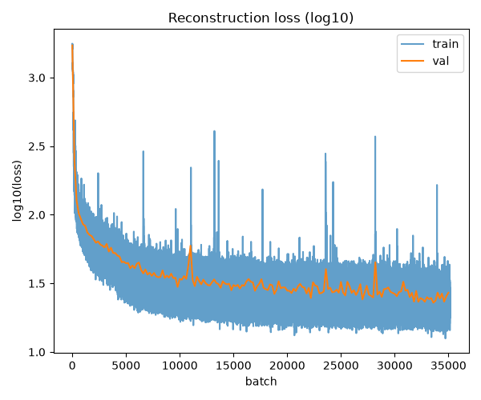

# world-models

A reimplementation (and a few deviations) of Ha & Schmidhuber's
["World Models"](https://arxiv.org/abs/1803.10122) — an agent that
learns to drive in CarRacing-v3 using a VAE to compress what it sees,
an MDN-RNN to imagine what happens next, and a tiny CMA-ES-trained
controller that barely has to think at all.

The whole point of this repo is to be small enough to actually read.
No config yaml sprawl, no ten-deep folder trees. If you want to know
what the VAE looks like, open `models.py`. That's it.

## 1. Background

The original paper is one of the more elegant ideas in RL: instead of
learning a policy end-to-end from pixels, split the problem into three
dumb, small pieces:

1. **See** — compress a 96x96 frame into a small latent vector (VAE).
2. **Predict** — learn how that latent evolves over time, conditioned
   on actions (MDN-RNN).
3. **Act** — a tiny controller (a few hundred parameters) maps
   latent + memory to an action, trained with evolution instead of
   backprop, since the reward signal here isn't differentiable anyway.

The original CarRacing agent hit an average of 900.46 over 1024
rollouts after 1800 generations of CMA-ES. That's the number this repo
is chasing, with a fraction of the compute budget.

## 2. Models

Everything lives in `models.py` — one file, three classes:

- **`VariationalAutoEncoder`** — standard conv encoder/decoder, 128-dim
  latent. Deliberately *not* downsampled to 64x64 like the original
  paper — full 96x96, on the bet that more visual detail helps the
  downstream controller.
- **`MixtureDensityNetwork`** — an LSTM + a mixture-of-Gaussians output
  head. Predicts a distribution over the next latent, not a single
  point estimate, because the future genuinely is uncertain (which way
  will the track curve?).
- **`MLP`** (the controller) — one linear layer. That's the whole
  policy. `[z, h] -> [steer, gas, brake]`, tanh-squashed into range.
  If the world model did its job, the controller shouldn't need to be
  clever.

## 3. Training

Four stages, run in order, each one freezing the last:

rollout.py -> collect random-policy episodes from the env

train.py --model vae -> train the VAE on individual frames

latent.py -> encode every frame witht he frozen VAE

train.py --model rnn -> train the MDN-RNN on latent sequences

controller.py -> CMA-ES over the controller's 1.1k params

Ran on UNC's Longleaf cluster. VAE and MDN-RNN train with standard
backprop; the controller does not — it's optimized directly against
episode reward via CMA-ES, since reward from a physics sim isn't
something you can backprop through.

## 4. Results

[controller eval curve, final score, comparison to 900.46]

## 5. Future Directions

World Models (2018) is the ancestor of a whole family of latent
world-model approaches — Dreamer, Genie, JEPA, Cosmos, and others,
each relaxing some assumption this repo still makes (separate training
stages, a Gaussian-mixture prior, no planning at test time). This repo
was written to be small enough that swapping any one piece — a
different environment, an RSSM instead of an MDN-RNN, a learned
world-model-in-the-loop controller — shouldn't require touching
anything else.

---
