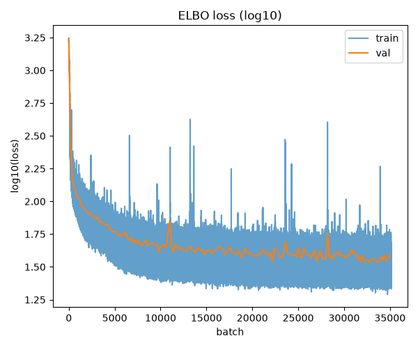
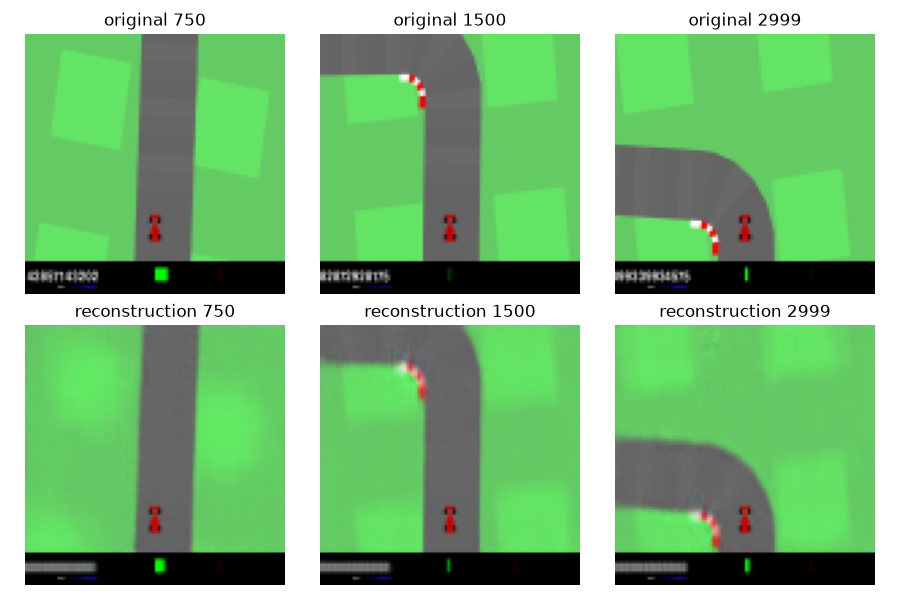
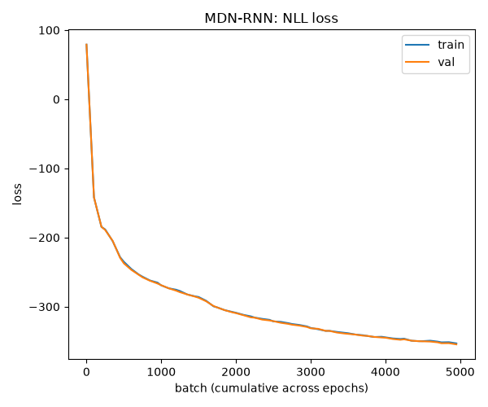
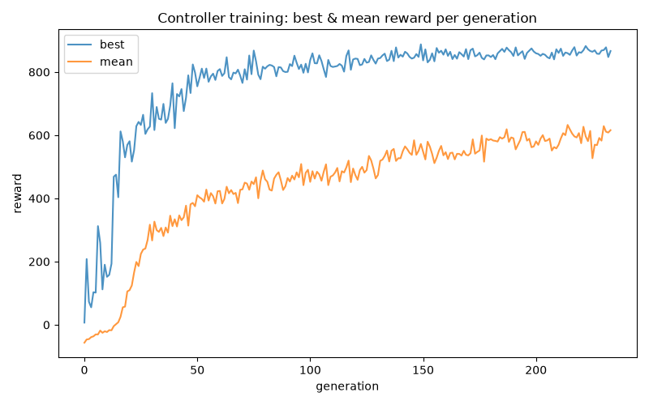

# world-models

A from-scratch reimplementation of Ha & Schmidhuber's
["World Models"](https://arxiv.org/abs/1803.10122) — an agent that
drives CarRacing-v3 having never backpropped through a single frame
of the real environment. It sees through a VAE, dreams through an
MDN-RNN, and acts through a controller with about a thousand
parameters trained with zero gradients at all.

```python
# the whole controller, in full
class MLP(nn.Module):
    def __init__(self):
        super().__init__()
        self.linear = nn.Linear(128 + 256, 3)

    def forward(self, z, h):
        a = self.linear(torch.cat([z, h], dim=-1))
        steer = torch.tanh(a[..., 0:1])
        gas   = (torch.tanh(a[..., 1:2]) + 1) / 2
        brake = (torch.tanh(a[..., 2:3]) + 1) / 2
        return torch.cat([steer, gas, brake], dim=-1)
```

That's it. If the world model did its job, the policy doesn't need to
be smart — it just needs to read a compressed version of reality and
a summary of the recent past.

## the idea

Three pieces, trained in order, each one frozen before the next starts:

| piece | job | trained with |
|---|---|---|
| **VAE** | compress a 96×96 frame → 128-dim `z` | backprop (ELBO) |
| **MDN-RNN** | predict a *distribution* over the next `z`, given `z` + action | backprop (NLL) |
| **Controller** | `z, h → action` | CMA-ES (no gradients — reward isn't differentiable) |

The original paper hit **900.46** avg reward (1024 rollouts) after
**1800 generations** of CMA-ES with population 64. This repo hits
**800** after **233 generations** with population 128 —
**~3.86x less total CMA-ES compute** than the original.

## report card

| | this repo (128-dim) | this repo (64-dim) | original paper |
|---|---|---|---|
| image resolution | 96×96 (no downsampling) | 96×96 (no downsampling) | 64×64 |
| latent dim | 128 | 64 | 32 |
| CMA-ES generations | 233 | 250 | 1800 |
| CMA-ES population | 128 | 128 | 64 |
| total population-members evaluated | ~29,824 | 32,000 | ~115,200 |
| total rollouts/episodes run | 477,184 | 512,000 | 1,843,200 |
| final score (avg, 2048 rollouts) | 801.56 | **881.0** | 900.46 |

## files

'models.py' - vae, mdn-rnn, controller. three classes, one file.

datasets.py - FrameDataset, EpisodeDataset, LatentDataset

rollout.py - collect episodes/evaluate a trained controller

latent.py - frozen vae -> z sequences, once per episode

train.py - train.py --model {vae,rnn}

controller.py - CMA-ES, its own file, own dependencies (cma, multiprocessing)

No config yaml, no trainer abstraction, no callback system. If you
want to know what the VAE looks like, you open `models.py` and you
look.

## training
Ran on UNC's Longleaf HPC cluster (SLURM, 128 CPU workers for the
controller stage, A100 for the VAE/MDN-RNN). ~1.1TB of rollout data,
10,000 episodes, 1000 frames each.

**VAE — ELBO & reconstruction loss:**




**MDN-RNN — NLL loss:**



**Controller — best & mean reward per generation:**



## what's next

World Models is the ancestor of a whole line of latent world-model
agents — Dreamer, Genie, JEPA, Cosmos — each relaxing one of the
assumptions still baked into this repo (separate training stages, a
Gaussian mixture prior, no test-time planning). Everything here was
kept small enough on purpose that swapping in any one piece — a
different environment, an RSSM instead of an MDN-RNN, a
world-model-in-the-loop controller — shouldn't require touching
anything else.
